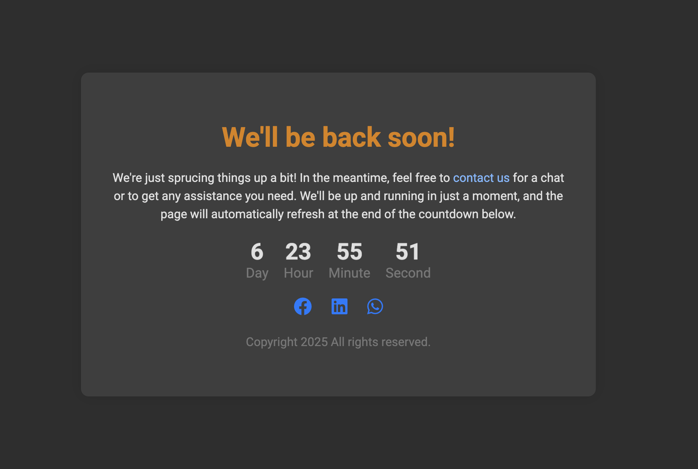

# Simple Maintenance Page

A clean, responsive HTML maintenance page with countdown timer that you can quickly deploy when your website is undergoing maintenance or experiencing downtime.



## Features

- 🎨 Clean, modern design with responsive layout
- ⏱️ Automatic countdown timer (configurable)
- 🌓 Dark mode support via `prefers-color-scheme` media query
- 📱 Mobile-friendly design
- 🔄 Automatic page refresh when countdown ends
- 🔗 Social media links
- 📧 Contact email link
- 🌐 SEO-friendly with proper meta tags

## Usage

1. Clone this repository:

   ```bash
   git clone https://github.com/to4kin/simple-maintenance-page.git
   ```

2. Customize the `index.html` file:

   - Update the contact email (`contact@example.com`)
   - Modify the countdown duration (default is 7 days)
   - Change social media links
   - Update the copyright year
   - Add your logo if needed

3. Deploy the `index.html` file to your web server or hosting service.

## Customization

### Changing the Countdown Duration

Edit the JavaScript in `index.html` around line 224:

```javascript
// Set the countdown to 7 days from now
const stringDate = new Date(
  Date.now() + 7 * 24 * 60 * 60 * 1000
).toLocaleString();
```

Change `7` to the number of days you want, or modify the calculation for hours/minutes.

### Changing Colors

The color scheme can be modified in the CSS section of the HTML file. The main colors are:

- Primary heading color: `#dc8100`
- Link color: `#007bff`
- Background color: `#f8f9fa`
- Container background: `white`

Dark mode colors are defined in the `@media (prefers-color-scheme: dark)` section.

## Browser Compatibility

This maintenance page is compatible with all modern browsers including:

- Chrome
- Firefox
- Safari
- Edge

## License

This project is licensed under the GNU General Public License v3.0 - see the [LICENSE](LICENSE) file for details.

## Contributing

Contributions are welcome! Feel free to open issues or submit pull requests to improve this maintenance page.

---

Created by [to4kin](https://github.com/to4kin)
